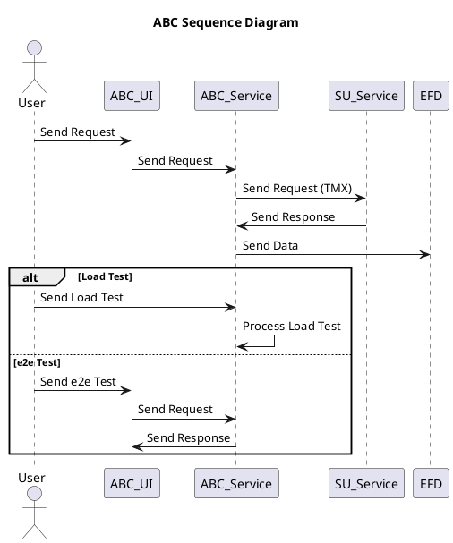

## Question

Create a PlantUML sequence diagram with the following flow:

- ABC UI -> ABC service -> SU service(TMX)
- ABC service -> EFD
- Option flow: Load Test -> ABC service
- Option flow: e2e Test -> ABC UI

## Answer

Here is the PlantUML sequence diagram with the flow:



Explanation:

- The diagram starts with the User sending a request to the ABC_UI.
- ABC_UI then sends the request to ABC_Service.
- ABC_Service sends the request to SU_Service(TMX) and waits for a response.
- SU_Service(TMX) processes the request and sends the response back to ABC_Service.
- ABC_Service sends the data to EFD.
- The diagram has two optional flows, one for Load Test and another for e2e Test:
  - If it is Load Test, the User sends a Load Test request to ABC_Service, and ABC_Service processes it.
  - If it is e2e Test, the User sends an e2e Test request to ABC_UI, and ABC_UI sends the request to ABC_Service, which sends a response back to ABC_UI.

---


Here is the PlantUML component diagram with the above information:

```plantuml
@startuml
title ABC Component Diagram

package "User Interface" {
  [ABC UI]
}

package "ABC Service" {
  [ABC Service]
}

package "SU Service" {
  [SU Service (TMX)]
}

package "External Service" {
  [EFD]
}

database "Data Storage" {
  [Database]
}

[ABC UI] --> [ABC Service]
[ABC Service] --> [SU Service (TMX)]
[ABC Service] --> [EFD]
[ABC Service] --> [Database]

@enduml
```

Explanation:

- The component diagram shows the components involved in the ABC system, including the ABC UI, ABC Service, SU Service (TMX), EFD, and Database.
- The ABC UI communicates with the ABC Service, which in turn communicates with the SU Service (TMX) and the EFD.
- The ABC Service also interacts with the Database for data storage.
