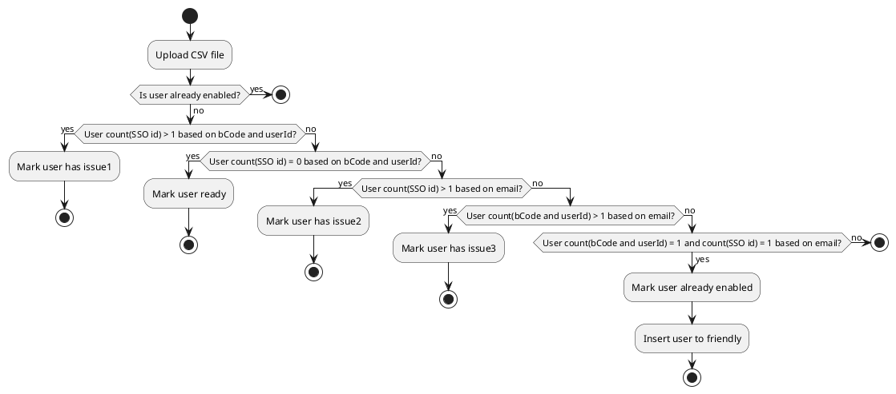

## PlantUML activity diagram that has a lot of rules

## Question

Create a PlantUML activity diagram for the following flow:

- Upload CSV file
- Check if the user is already enabled. If yes, stop.
- If no, check if user count(SSO id) > 1 based on bCode and userId. If yes, mark user has issue1 and stop.
- If no, check if user count(SSO id) = 0 based on bCode and userId. If yes, mark user ready and stop.
- If no, check if user count(SSO id) > 1 based on email. If yes, mark user has issue2 and stop.
- If no, check if user count(bCode and userId) > 1 based on email. If yes, mark user has issue3 and stop.
- If no, check if user count(bCode and userId) = 1 and count(SSO id) = 1 based on email. If yes, mark user already enabled and insert user to friendly and stop.
- If no, stop

## Answer

The diagram starts with the "Upload CSV file" activity and then goes through a series of checks to determine the user's status. If the user is already enabled, the flow stops. Otherwise, it checks for various conditions such as the number of users with the same SSO ID or email address. If any of these conditions are met, the user is marked with an issue and the flow stops. If all checks are passed, the user is marked as ready or already enabled, and in the latter case, the user is inserted into the friendly list. Finally, the flow ends with the "stop" activity.